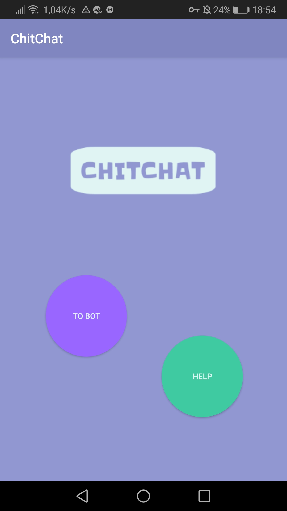
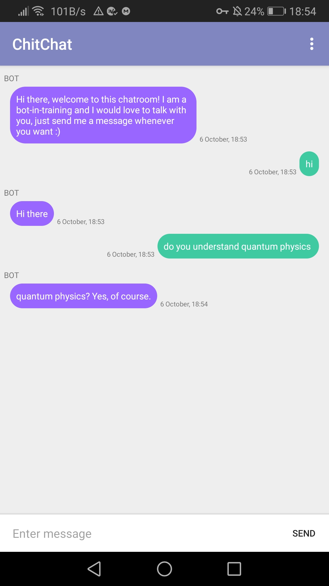

# ChitChat
Chatting application to serve as a medium for chatbot conversations.

The chatbot logic is contained in a self-written Python module that is connected to the app by means of Chaquopy (https://chaquo.com/chaquopy/).

Home screen             |  Chat interface
:-------------------------:|:-------------------------:
  |  
